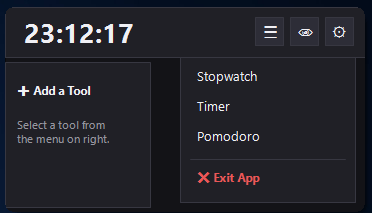
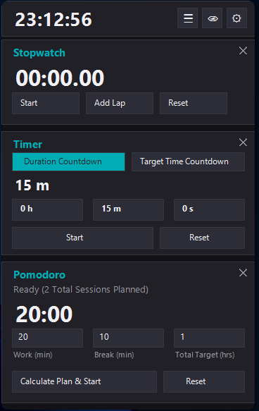
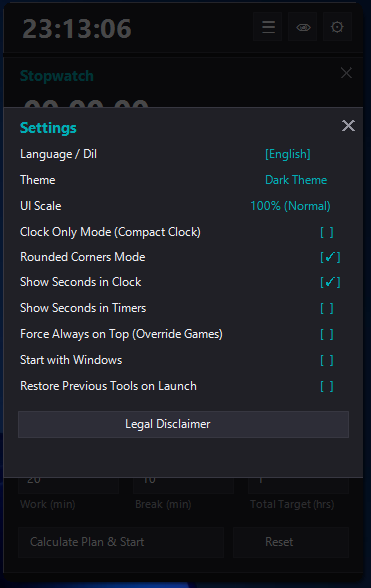

<div align="center">


# ETDTimer v1.0.0

**Modern, Ultra-Lightweight & Modular Desktop Timer Suite for Windows**  
*Windows için Modern, Ultra Hafif ve Modüler Masaüstü Zamanlayıcı Paketi*

[](https://github.com/emirtugra-dag/ETDTimer/releases/tag/v1.0.0)
[](LICENSE)
[](https://microsoft.com/windows)
[](https://isocpp.org/)
[](https://learn.microsoft.com/en-us/windows/win32/)
[](#language-dil)
[](https://github.com/emirtugra-dag/ETDTimer/tree/main/releases)

---

### 📦 Quick Downloads / Hızlı İndirme (v1.0.0 Signed)

[ 📥 **Download Setup Installer (`ETDTimerSetup.exe`)** ](releases/ETDTimerSetup.exe)  
[ 📦 **Download Portable Package (`ETDTimer-v1.0.0-Portable.zip`)** ](releases/ETDTimer-v1.0.0-Portable.zip)  
[ ⚡ **Download Standalone Portable (`ETDTimer.exe`)** ](releases/ETDTimer.exe)

---

### Language / Dil
[ 🇬🇧 **English Readme** ](#-english) &nbsp;|&nbsp; [ 🇹🇷 **Türkçe Oku** ](#-türkçe)

---

</div>

<a name="english"></a>
## 🇬🇧 English

### 🌟 Overview
**ETDTimer** is a high-performance, native C++ desktop application designed for Windows. Built directly on pure **Win32 API** and **GDI+**, it offers zero external GUI framework overhead, blistering startup speed, and minimal memory usage (<15 MB RAM). 

Whether you need a sleek desktop clock, an accurate stopwatch, a countdown timer with target time capabilities, or a productive Pomodoro planner, ETDTimer delivers a smooth, glassmorphic UI tailored for modern desktop workflows.

---

### ✨ Key Features

- 🕒 **Digital Desktop Clock & Compact "Clock Only" Mode**:
  - Displays real-time digital clock with optional seconds display.
  - One-click compact mode shrinks the window to an ultra-minimal desktop widget (190px / 240px dynamic sizing) with zero screen clutter and standalone Close (`✕`) / Settings (`⚙`) buttons.

- ⏱️ **High-Precision Stopwatch**:
  - Millisecond precision powered by Windows hardware performance counters (`GetTickCount64()`).
  - Supports unlimited lap recording with smooth interactive mouse wheel scrolling.

- ⏳ **Multimodal Countdown Timer**:
  - **Duration Countdown Mode**: Enter Hours, Minutes, and Seconds directly via spacious, clean input boxes.
  - **Target Time Countdown Mode**: Set a target time (e.g. `11:49` or `23:30`) and the app automatically calculates the exact countdown delta until that time arrives.

- 🍅 **Smart Pomodoro Planner**:
  - Automatically calculates work sessions and breaks based on total target hours.
  - Real-time phase tracking (`Work Phase`, `Break Phase`, `Finished`).

- 🎨 **Modern Glassmorphic UI & Scaling**:
  - Dynamic DPI Scaling (%85 Small, %100 Normal, %120 Large) with crisp anti-aliased GDI+ rendering.
  - **Rounded Corners Mode**: Win32 region clipping for sleek rounded window borders.
  - Dark Mode & Light Mode support.

- 🔊 **Audio Alerts & High-Pitched Digital Beep**:
  - Custom audio file support (`.mp3`, `.wav`) or built-in crisp **2600 Hz high-pitched digital timer alarm** pattern (`Öt-bırak, öt-bırak!`).
  - Runs in a background thread to prevent UI freezing.

- 🚀 **Start with Windows (AutoStart)**:
  - Both **Portable** and **Installer** versions support automatic Windows startup integration with dynamic executable path registration (`HKCU\Software\Microsoft\Windows\CurrentVersion\Run`).

- 🛡️ **System Tray & Single Executable Deployment**:
  - System Tray Icon integration with quick context menu (`Show / Hide`, `Exit`).
  - Ships as a single self-contained installer (`ETDTimerSetup.exe`) signed with self-signed certificate.

---

### 🖼️ Screenshots

<div align="center">

#### 1. Compact Clock Only Mode / Kompakt Saat Modu


#### 2. Burger Menu & Modular Launcher / Araç Ekleme Menüsü


#### 3. Full Modular Tools View / Modüler Araçlar (Stopwatch, Timer, Pomodoro)


#### 4. Settings & Customization Modal / Ayarlar Penceresi


</div>

---

### 🚀 Download & Installation Options

- **Option 1: Setup Installer (`ETDTimerSetup.exe`)**
  - Download [ETDTimerSetup.exe](releases/ETDTimerSetup.exe).
  - Installs ETDTimer with desktop shortcuts, Start Menu entry, and Windows Control Panel uninstaller.

- **Option 2: Portable ZIP Package (`ETDTimer-v1.0.0-Portable.zip`)**
  - Download [ETDTimer-v1.0.0-Portable.zip](releases/ETDTimer-v1.0.0-Portable.zip).
  - Extract anywhere and run `ETDTimer.exe`. No installation or administrative privileges required.

- **Option 3: Standalone Executable (`ETDTimer.exe`)**
  - Download [ETDTimer.exe](releases/ETDTimer.exe) directly and run anywhere.

---

### 🛠️ Building from Source

**Prerequisites**:
- MinGW-w64 (`g++` compiler supporting C++20)
- Windows SDK (`windres`, `gdiplus`, `winmm`, `shlwapi`)

**Build Command**:
```powershell
powershell -ExecutionPolicy Bypass -File "build_and_sign.ps1"
```
This compiles `ETDTimer.exe`, packs it into `ETDTimerSetup.exe`, and digitally signs both executables.

---

### 📜 Legal Disclaimer & License

ETDTimer is released under the **MIT License**.

> **Legal Notice**:  
> Bu yazılım "olduğu gibi" (As-Is) sunulmaktadır. Geliştirici Emir Tuğra Dağ, uygulamanın kullanımından doğabilecek doğrudan ya da dolaylı hiçbir durum, zarar veya aksaklıktan sorumlu tutulamaz. Geliştiricinin yazılıma güncelleme getirme veya bakım yapma zorunluluğu bulunmamaktadır. Kod tabanı MIT Lisansına tabi olup; projenin adı, logosu ve tüm hakları Emir Tuğra Dağ'a aittir.

Copyright (c) 2026 **Emir Tuğra Dağ**. All rights reserved.

---

<br />

---

<a name="türkçe"></a>
## 🇹🇷 Türkçe

### 🌟 Genel Bakış
**ETDTimer**, Windows işletim sistemi için geliştirilmiş yüksek performanslı, yerel (native) bir C++ masaüstü zamanlayıcı uygulamasıdır. Doğrudan saf **Win32 API** ve **GDI+** üzerine inşa edilmiş olup hiçbir harici GUI kütüphanesi yükü taşımaz. Yıldırım hızında açılır ve minimum bellek tüketir (<15 MB RAM).

Şık bir masaüstü saatine, hassas bir kronometreye, hedef saate göre sayabilen gelişmiş bir geri sayım sayacına veya verimliliğinizi artıracak bir Pomodoro planlayıcıya ihtiyacınız olduğunda ETDTimer size modern ve pürüzsüz bir arayüz sunar.

---

### ✨ Öne Çıkan Özellikler

- 🕒 **Dijital Masaüstü Saati & Sadece Saat Modu**:
  - İsteğe bağlı saniye gösterimi sunan dijital saat.
  - Tek tıkla açılabilen **Sadece Saat Modu** sayesinde masaüstünüzde hiçbir fazlalık yer kaplamayan (190px / 240px dinamik boyutlu) şık bir saat penceresi.

- ⏱️ **Yüksek Hassasiyetli Kronometre**:
  - Windows donanım sayaçları (`GetTickCount64()`) ile milisaniye hassasiyetinde zaman takibi.
  - Sınırsız tur kaydı (`Add Lap`) ve fare tekerleği ile kaydırılabilir tur listesi.

- ⏳ **Çok Modlu Geri Sayım Sayacı**:
  - **Süre Sayımı Modu**: Saat, Dakika ve Saniye kutularına doğrudan değer girerek geri sayım başlatın.
  - **Hedef Saate Sayım Modu**: Hedef saati girin (örn: `11:49` veya `23:30`), uygulama belirtilen saate kalan süreyi otomatik hesaplayıp geri sayımı başlatsın.

- 🍅 **Akıllı Pomodoro Planlayıcı**:
  - Hedeflenen toplam çalışma saatine göre çalışma ve mola periyotlarını otomatik planlar.
  - Canlı periyot takibi (`Çalışma Periyodu`, `Mola Periyodu`, `Tamamlandı!`).

- 🎨 **Modern Glassmorphic Arayüz & Ölçeklendirme**:
  - Dinamik Arayüz Ölçeklendirme (%85 Küçük, %100 Normal, %120 Büyük).
  - **Yuvarlatılmış Kenarlar Modu**: Win32 region clipping ile yuvarlatılmış pencere köşeleri.
  - Koyu (Dark) ve Açık (Light) tema desteği.

- 🔊 **Sesli Uyarılar & Tiz Dijital Bipleme**:
  - Özel ses dosyası yükleme (`.mp3`, `.wav`) veya yerleşik **2600 Hz tiz dijital kronometre bipleme** ritmi (`Öt-bırak, öt-bırak!`).
  - Arka plan thread'inde çalışarak arayüzün takılmasını engeller.

- 🚀 **Sistem Başlangıcında Çalışma (AutoStart)**:
  - Hem **Portable (Taşınabilir)** hem de **Kurulumlu (Installer)** sürümlerde uygulama içinden "Sistem Başlangıcında Çalıştır" seçildiğinde executable dosyasının bulunduğu tam dizini kayıt defterine (`HKCU\Software\Microsoft\Windows\CurrentVersion\Run`) dinamik olarak kaydeder ve sorunsuz çalışır.

- 🛡️ **Sistem Tepsisi & Tek Tıkla Kurulum**:
  - Sistem tepsisi (System Tray Icon) sağ tık menüsü (`Göster / Gizle`, `Çıkış`).
  - Dijital olarak imzalanmış tek tıkla kurulan kurulum dosyası (`ETDTimerSetup.exe`).

---

### 📦 İndirme Seçenekleri (v1.0.0 İmzalı)

- **Seçenek 1: Kurulumlu Kurucu (`ETDTimerSetup.exe`)**
  - [ETDTimerSetup.exe İndir](releases/ETDTimerSetup.exe). Masaüstü kısayolu, Başlat menüsü öğesi ve Denetim Masası kaldırıcı içerir.

- **Seçenek 2: Taşınabilir ZIP Paketi (`ETDTimer-v1.0.0-Portable.zip`)**
  - [ETDTimer-v1.0.0-Portable.zip İndir](releases/ETDTimer-v1.0.0-Portable.zip). İstediğiniz yere çıkartıp doğrudan `ETDTimer.exe` çalıştırın. Kurulum gerektirmez.

- **Seçenek 3: Tek Başna Taşınabilir Executable (`ETDTimer.exe`)**
  - Doğrudan [ETDTimer.exe İndir](releases/ETDTimer.exe) ve çalıştır.

---

### 🛠️ Kaynak Koddan Derleme

```powershell
powershell -ExecutionPolicy Bypass -File "build_and_sign.ps1"
```

---

### 📜 Yasal Bildirim ve Lisans

ETDTimer **MIT Lisansı** ile lisanslanmıştır.

> **Yasal Bildirim & Sorumluluk Reddi**:  
> Bu yazılım "olduğu gibi" (As-Is) sunulmaktadır. Geliştirici Emir Tuğra Dağ, uygulamanın kullanımından doğabilecek doğrudan ya da dolaylı hiçbir durum, zarar veya aksaklıktan sorumlu tutulamaz. Geliştiricinin yazılıma güncelleme getirme veya bakım yapma zorunluluğu bulunmamaktadır. Kod tabanı MIT Lisansına tabi olup; projenin adı, logosu ve tüm hakları Emir Tuğra Dağ'a aittir.

Tüm Hakları Saklıdır © 2026 **Emir Tuğra Dağ**.
